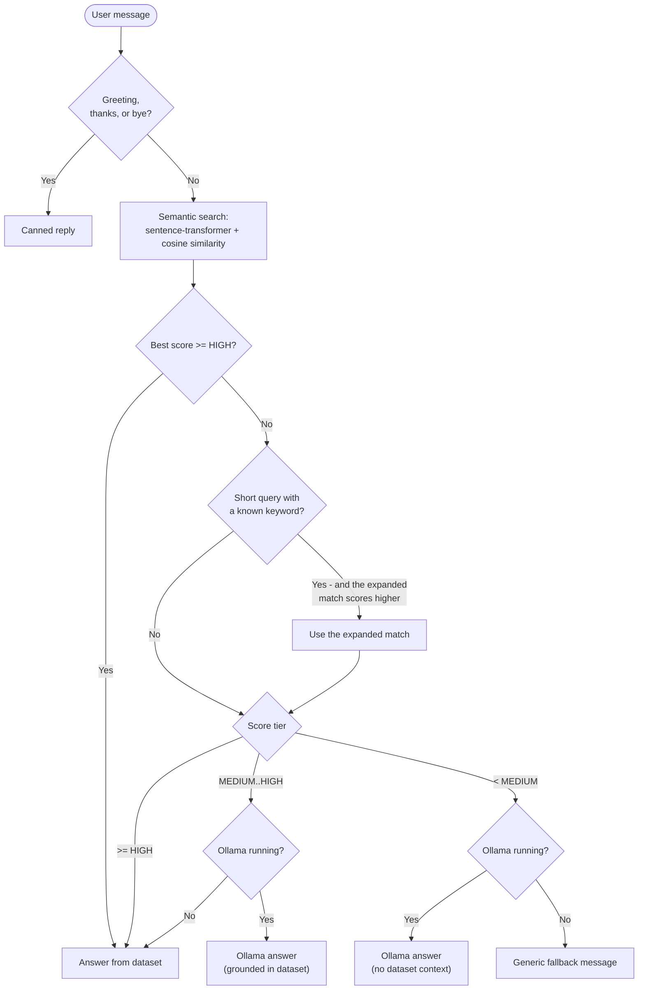

# 🤖 PlaceBot - AI-Powered Placement Preparation Assistant


PlaceBot is a hybrid chatbot that answers placement-preparation questions
(CGPA cutoffs, resume tips, DSA topics, internships, HR rounds, company
info, and more). It combines a curated CSV of Q&A pairs, semantic search
via sentence embeddings, and an **optional** local LLM (via
[Ollama](https://ollama.ai)) for more natural, conversational answers when
the dataset alone isn't a confident enough match.

It ships as a small FastAPI backend with a clean, single-page chat UI - no
frontend framework or build step required.

---

## ✨ Features

- **Hybrid response engine** - combines a curated dataset, semantic search,
  and an optional local LLM, choosing the best strategy per question.
- **Semantic search** using [sentence-transformers](https://www.sbert.net/)
  (`all-MiniLM-L6-v2`) + cosine similarity, so questions don't need to match
  the dataset word-for-word.
- **Confidence-tiered routing** - high-confidence matches are answered
  straight from the dataset; medium-confidence matches are enriched by the
  LLM (if available); low-confidence input falls back to the LLM or a
  helpful "I'm not sure, but here's what I can help with" message.
- **Rule-based shortcuts** for greetings, thanks, and goodbyes - and for
  short queries like `"cgpa"` or `"resume"`.
- **Runs with or without Ollama** - if Ollama isn't installed/running,
  PlaceBot automatically falls back to dataset-only mode.
- **Polished chat UI** - typing indicator, per-message source/confidence
  badges, graceful error states, and a responsive layout.
- **Configurable via `.env`** - thresholds, Ollama model, ports, etc.
- **REST API with interactive docs** at `/docs` (Swagger UI).
- **Unit-tested** core logic with `pytest`.

---

## 🧠 How It Works



1. **Rule-based layer** - greetings, "thanks", and "bye" get instant canned
   replies.
2. **Semantic search** - the message is embedded and compared (via cosine
   similarity) against every dataset question.
3. **Keyword fallback** - if the literal match isn't confident *and* the
   message is short (≤ 3 words) and contains a known keyword (e.g. `cgpa`,
   `resume`, `dsa`), PlaceBot also tries a re-phrased version and uses
   whichever scores higher.
4. **Confidence routing**:
   - **High** -> answer comes straight from the dataset.
   - **Medium** -> the dataset answer is passed to Ollama as *context* for a
     more natural rewrite (falls back to the raw dataset answer if Ollama is
     unavailable).
   - **Low** -> Ollama answers with no dataset context, or PlaceBot returns a
     friendly "here's what I can help with" message.

---

## 🛠️ Tech Stack

| Layer            | Technology                                              |
| ---------------- | -------------------------------------------------------- |
| Backend          | [FastAPI](https://fastapi.tiangolo.com/) + [Uvicorn](https://www.uvicorn.org/) |
| Semantic search  | [sentence-transformers](https://www.sbert.net/) (`all-MiniLM-L6-v2`), scikit-learn |
| Data             | pandas, numpy, CSV                                       |
| Optional LLM     | [Ollama](https://ollama.ai) (default model: `llama3.2`)  |
| Frontend         | Vanilla HTML / CSS / JavaScript (no build step)           |
| Configuration    | `python-dotenv`                                          |
| Testing          | `pytest`                                                 |

---

## 📂 Project Structure

```
PlaceBot/
├── main.py              # FastAPI app: routes, startup ("lifespan"), CORS
├── chatbot.py           # PlacementChatbot - the hybrid response engine
├── ollama_client.py     # Thin client for a local Ollama server
├── text_utils.py        # Rule-based replies, preprocessing, keyword shortcuts
├── config.py            # Settings loaded from environment variables / .env
├── schemas.py           # Pydantic request/response models
├── data.csv             # Placement Q&A dataset (question, answer)
├── static/
│   └── index.html       # Chat UI (vanilla HTML/CSS/JS)
├── tests/
│   ├── test_text_utils.py
│   ├── test_schemas.py
│   └── test_ollama_client.py
├── conftest.py           # Adds the project root to sys.path for tests
├── pytest.ini             # Scopes pytest to tests/
├── test_setup.py          # Standalone environment-check CLI
├── requirements.txt        # Runtime dependencies
├── requirements-dev.txt    # Runtime deps + pytest
├── .env.example             # Configuration template
└── .gitignore
```

---

## 🚀 Getting Started

### Prerequisites

- Python **3.10+**
- pip
- *(Optional)* [Ollama](https://ollama.ai) for AI-enhanced responses

### 1. Clone and install

```bash
git clone https://github.com/<your-username>/PlaceBot.git
cd PlaceBot

python -m venv venv
source venv/bin/activate      # On Windows: venv\Scripts\activate

pip install -r requirements.txt
```

### 2. (Optional) Configure

```bash
cp .env.example .env
```

Edit `.env` to change the port, confidence thresholds, Ollama model, etc.
Every setting has a sensible default, so this step can be skipped.

### 3. Verify your setup

```bash
python test_setup.py
```

This checks your Python version, dependencies, dataset, and (optionally)
Ollama, and tells you exactly what's missing if anything fails.

### 4. Run PlaceBot

```bash
python main.py
```

or, equivalently:

```bash
uvicorn main:app --reload
```

On first run, PlaceBot downloads the `all-MiniLM-L6-v2` embedding model
(~80 MB) and generates embeddings for the dataset - this can take a minute.
Your browser should open automatically to **http://127.0.0.1:8000**.

---

## 🤖 Enabling AI-Enhanced Responses (Ollama)

PlaceBot works great without Ollama - it simply answers from the dataset.
To enable richer, more conversational responses for medium/low-confidence
questions:

1. Install Ollama from [ollama.ai](https://ollama.ai).
2. Pull a model (the default is `llama3.2`):
   ```bash
   ollama pull llama3.2
   ```
3. Make sure the Ollama service is running (it typically runs in the
   background after installation).
4. (Re)start PlaceBot - it automatically detects Ollama on startup and
   switches to **hybrid** mode.

To force dataset-only mode (e.g. for a lightweight demo), set
`OLLAMA_ENABLED=false` in your `.env` file.

> **Note:** Ollama availability is only checked once, at startup. If you
> start Ollama *after* PlaceBot, restart PlaceBot (or check `/health`) to
> pick it up.

---

## 🔌 API Reference

| Method | Path      | Description                                              |
| ------ | --------- | --------------------------------------------------------- |
| GET    | `/`       | Chat UI                                                    |
| POST   | `/chat`   | Send a message, get a reply (see below)                   |
| GET    | `/health` | Health check - dataset/Ollama status, current mode         |
| GET    | `/stats`  | Dataset size, embedding model, confidence thresholds        |
| GET    | `/docs`   | Interactive Swagger UI (auto-generated by FastAPI)          |

### `POST /chat`

**Request**

```json
{ "message": "What CGPA is required for placements?" }
```

**Response**

```json
{
  "reply": "Most companies require above 8 CGPA as minimum eligibility...",
  "confidence": 1.0,
  "source": "dataset",
  "matched_question": "minimum cgpa required for placements",
  "context_used": null
}
```

`source` is one of: `greeting`, `thanks`, `bye`, `dataset`,
`dataset-fallback`, `ollama-hybrid`, `ollama-pure`, `fallback`, or `error`.

**Example with curl**

```bash
curl -X POST http://127.0.0.1:8000/chat \
  -H "Content-Type: application/json" \
  -d '{"message": "how to prepare for hr round"}'
```

---

## 🧪 Running Tests

```bash
pip install -r requirements-dev.txt
pytest
```

The test suite covers the rule-based logic (`text_utils`), API request
validation (`schemas`), and the Ollama client (with HTTP calls mocked) -
**it does not require downloading the embedding model**, so it runs in
under a second.

---

## 📊 Dataset

`data.csv` contains 116 `question,answer` pairs covering placement
preparation strategy, CGPA requirements, resumes, DSA, internships, HR
rounds, aptitude, company information, and more.

To add your own Q&A pairs, just append rows with the same two columns and
restart the server - embeddings are regenerated automatically on startup.

---

## ⚠️ Known Limitations

- **Startup-time Ollama check** - if Ollama is started after PlaceBot,
  restart PlaceBot to switch into hybrid mode.
- **In-memory embeddings** - fine for a dataset of this size, but a large
  dataset (thousands of rows) would benefit from a proper vector store
  (e.g. FAISS, Chroma, pgvector).
- **No conversation memory** - each message is answered independently, with
  no multi-turn context.
- **Open CORS policy** (`allow_origins=["*"]`) - convenient for local
  development; restrict this if you deploy PlaceBot publicly.
- **Hand-tuned confidence thresholds** - `HIGH_CONFIDENCE` /
  `MEDIUM_CONFIDENCE` work well for this dataset, but may need adjusting as
  the dataset grows or changes.

---

## 🗺️ Future Enhancements

- Multi-turn conversation memory / context
- Streaming responses (SSE/WebSocket) for Ollama-generated replies
- A small admin UI or CLI for managing `data.csv` without manual editing
- Async routes + `httpx` for higher concurrency
- Vector database integration for larger datasets
- Rate limiting / authentication for public deployments
- Docker support for one-command setup
- Structured logging (Python's `logging` module) with configurable levels
- CI workflow (GitHub Actions) to run `pytest` on every push

---

<!--## 🤝 Contributing

This started as a personal placement-prep project and is shared for
learning and feedback. Issues, suggestions, and pull requests are welcome!

## 📄 License

No license has been chosen yet. If you'd like others to be able to use or
build on this project, consider adding an [MIT License](https://choosealicense.com/licenses/mit/)
(GitHub can generate this for you when creating the repository).-->
